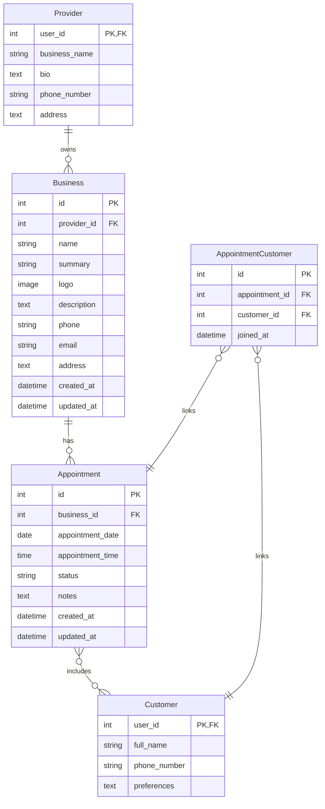

# Design Document: Business and Appointment Management

## Overview

This design implements a business and appointment management system for AliceTant, enabling providers to create and manage multiple businesses with profile information (summary and logo), and allowing customers to book appointments with these businesses. The system builds on the existing user data model and extends it with business entities and appointment scheduling capabilities.

The design prioritizes:
- **Strong consistency**: Preventing double-booking through database constraints and transactions
- **Provider flexibility**: Allowing multiple businesses per provider
- **Rich business profiles**: Supporting summaries and logo images
- **Multi-customer appointments**: Supporting group bookings
- **Clear ownership**: Enforcing provider authorization for business operations

## Architecture

### Layered Architecture

```
┌─────────────────────────────────────────┐
│         Frontend (React)                │
│  - BusinessManagement component         │
│  - AppointmentBooking component         │
│  - AppointmentHistory component         │
└─────────────────┬───────────────────────┘
                  │ HTTP/REST
                  ▼
┌─────────────────────────────────────────┐
│      Django REST Framework Views        │
│  - BusinessViewSet                      │
│  - AppointmentViewSet                   │
└─────────────────┬───────────────────────┘
                  │
                  ▼
┌─────────────────────────────────────────┐
│      Serializers (Validation)           │
│  - BusinessSerializer                   │
│  - AppointmentSerializer                │
└─────────────────┬───────────────────────┘
                  │
                  ▼
┌─────────────────────────────────────────┐
│      Services (Business Logic)          │
│  - BusinessService                      │
│  - AppointmentService                   │
└─────────────────┬───────────────────────┘
                  │
                  ▼
┌─────────────────────────────────────────┐
│      Repositories (Data Access)         │
│  - BusinessRepository                   │
│  - AppointmentRepository                │
└─────────────────┬───────────────────────┘
                  │
                  ▼
┌─────────────────────────────────────────┐
│      Django ORM / Models                │
│  - Business (updated)                   │
│  - Appointment (new)                    │
│  - AppointmentCustomer (new)            │
└─────────────────┬───────────────────────┘
                  │
                  ▼
┌─────────────────────────────────────────┐
│      Database (SQLite) + File Storage   │
└─────────────────────────────────────────┘
```

### Design Decisions

1. **Business Model Extension**: Update the existing Business model to add `summary` (512 chars) and `logo` (ImageField) while keeping existing fields for backward compatibility.

2. **Many-to-Many Appointments**: Use an explicit through model (`AppointmentCustomer`) for the many-to-many relationship between appointments and customers, allowing future extension (e.g., customer-specific notes).

3. **Soft Delete for Appointments**: Use a `status` field with ACTIVE/CANCELLED states rather than hard deleting appointments, preserving history for both providers and customers.

4. **File Storage**: Use Django's default file storage system for logos, which can be easily swapped for cloud storage (S3, etc.) in production.

5. **Authorization Layer**: Implement business ownership checks in the service layer to ensure providers can only modify their own businesses.

6. **Unique Constraint for Time Slots**: Add a database constraint to prevent double-booking the same business at the same date/time.

## Components and Interfaces

### 1. Updated Business Model (`backend/AliceTant/models/business.py`)

```python
from django.db import models
from .provider import Provider

class Business(models.Model):
    """
    Business model representing a service offering by a provider.
    
    Each provider can create multiple businesses with profile information
    including a summary and logo.
    """
    
    provider = models.ForeignKey(
        Provider,
        on_delete=models.CASCADE,
        related_name='businesses'
    )
    name = models.CharField(max_length=200)
    summary = models.CharField(
        max_length=512,
        blank=True,
        help_text="Brief description of the business (max 512 characters)"
    )
    logo = models.ImageField(
        upload_to='business_logos/',
        blank=True,
        null=True,
        help_text="Business logo image"
    )
    # Existing fields
    description = models.TextField(max_length=2000, blank=True)
    phone = models.CharField(max_length=20, blank=True)
    email = models.EmailField(blank=True)
    address = models.TextField(blank=True)
    created_at = models.DateTimeField(auto_now_add=True)
    updated_at = models.DateTimeField(auto_now=True)
    
    class Meta:
        ordering = ['-created_at']
        indexes = [
            models.Index(fields=['provider', '-created_at']),
        ]
```

### 2. Appointment Model (`backend/AliceTant/models/appointment.py`)

```python
from django.db import models
from django.utils import timezone
from .business import Business
from .customer import Customer

class AppointmentStatus(models.TextChoices):
    ACTIVE = 'ACTIVE', 'Active'
    CANCELLED = 'CANCELLED', 'Cancelled'

class Appointment(models.Model):
    """
    Appointment model representing a scheduled booking.
    
    Connects one or more customers with a business at a specific date/time.
    """
    
    business = models.ForeignKey(
        Business,
        on_delete=models.CASCADE,
        related_name='appointments'
    )
    customers = models.ManyToManyField(
        Customer,
        through='AppointmentCustomer',
        related_name='appointments'
    )
    appointment_date = models.DateField()
    appointment_time = models.TimeField()
    status = models.CharField(
        max_length=10,
        choices=AppointmentStatus.choices,
        default=AppointmentStatus.ACTIVE
    )
    notes = models.TextField(blank=True)
    created_at = models.DateTimeField(auto_now_add=True)
    updated_at = models.DateTimeField(auto_now=True)
    
    class Meta:
        ordering = ['appointment_date', 'appointment_time']
        indexes = [
            models.Index(fields=['business', 'appointment_date', 'appointment_time']),
            models.Index(fields=['appointment_date', 'status']),
        ]
        constraints = [
            models.UniqueConstraint(
                fields=['business', 'appointment_date', 'appointment_time'],
                condition=models.Q(status='ACTIVE'),
                name='unique_active_appointment_slot'
            )
        ]
    
    def is_upcoming(self):
        """Check if appointment is in the future."""
        from datetime import datetime
        appointment_datetime = datetime.combine(
            self.appointment_date,
            self.appointment_time
        )
        return appointment_datetime > datetime.now() and self.status == AppointmentStatus.ACTIVE

class AppointmentCustomer(models.Model):
    """
    Through model for Appointment-Customer many-to-many relationship.
    """
    
    appointment = models.ForeignKey(
        Appointment,
        on_delete=models.CASCADE
    )
    customer = models.ForeignKey(
        Customer,
        on_delete=models.CASCADE
    )
    joined_at = models.DateTimeField(auto_now_add=True)
    
    class Meta:
        unique_together = ['appointment', 'customer']
```

### 3. Business Repository (`backend/AliceTant/repositories/business_repository.py`)

```python
from typing import List, Optional
from django.core.files.uploadedfile import UploadedFile
from AliceTant.models import Business, Provider
from AliceTant.exceptions import BusinessNotFoundError, UnauthorizedAccessError

class BusinessRepository:
    """
    Repository for business data access operations.
    """
    
    @staticmethod
    def create_business(
        provider: Provider,
        name: str,
        summary: str = "",
        logo: Optional[UploadedFile] = None,
        **extra_fields
    ) -> Business:
        """Create a new business for a provider."""
        
    @staticmethod
    def get_business_by_id(business_id: int) -> Business:
        """Retrieve business by ID."""
        
    @staticmethod
    def get_businesses_by_provider(provider: Provider) -> List[Business]:
        """Retrieve all businesses owned by a provider."""
        
    @staticmethod
    def get_all_businesses(limit: int = 100, offset: int = 0) -> List[Business]:
        """Retrieve all businesses with pagination."""
        
    @staticmethod
    def search_businesses(query: str) -> List[Business]:
        """Search businesses by name or summary."""
        
    @staticmethod
    def update_business(
        business: Business,
        **fields
    ) -> Business:
        """Update business fields."""
        
    @staticmethod
    def delete_business(business_id: int, provider: Provider) -> bool:
        """Delete business if owned by provider."""
        
    @staticmethod
    def verify_ownership(business: Business, provider: Provider) -> bool:
        """Verify that provider owns the business."""
```

### 4. Appointment Repository (`backend/AliceTant/repositories/appointment_repository.py`)

```python
from typing import List
from datetime import date, time
from django.db import transaction
from AliceTant.models import Appointment, Business, Customer
from AliceTant.exceptions import (
    AppointmentNotFoundError,
    TimeSlotConflictError,
    InvalidAppointmentDataError
)

class AppointmentRepository:
    """
    Repository for appointment data access operations.
    """
    
    @staticmethod
    @transaction.atomic
    def create_appointment(
        business: Business,
        customers: List[Customer],
        appointment_date: date,
        appointment_time: time,
        notes: str = ""
    ) -> Appointment:
        """Create a new appointment with customers."""
        
    @staticmethod
    def get_appointment_by_id(appointment_id: int) -> Appointment:
        """Retrieve appointment by ID."""
        
    @staticmethod
    def get_appointments_by_business(
        business: Business,
        start_date: Optional[date] = None,
        end_date: Optional[date] = None
    ) -> List[Appointment]:
        """Retrieve appointments for a business, optionally filtered by date range."""
        
    @staticmethod
    def get_appointments_by_customer(customer: Customer) -> List[Appointment]:
        """Retrieve all appointments for a customer."""
        
    @staticmethod
    def get_appointments_by_provider(provider: Provider) -> List[Appointment]:
        """Retrieve all appointments for businesses owned by a provider."""
        
    @staticmethod
    def cancel_appointment(appointment_id: int) -> Appointment:
        """Cancel an appointment (soft delete)."""
        
    @staticmethod
    def check_time_slot_available(
        business: Business,
        appointment_date: date,
        appointment_time: time
    ) -> bool:
        """Check if a time slot is available for booking."""
```

### 5. Business Service (`backend/AliceTant/services/business_service.py`)

```python
class BusinessService:
    """
    Service layer for business operations with authorization checks.
    """
    
    @staticmethod
    def create_business_for_provider(
        provider: Provider,
        name: str,
        summary: str = "",
        logo: Optional[UploadedFile] = None,
        **extra_fields
    ) -> Business:
        """Create a business with validation."""
        
    @staticmethod
    def update_business_for_provider(
        business_id: int,
        provider: Provider,
        **fields
    ) -> Business:
        """Update business with ownership verification."""
        
    @staticmethod
    def delete_business_for_provider(
        business_id: int,
        provider: Provider
    ) -> bool:
        """Delete business with ownership verification."""
        
    @staticmethod
    def get_provider_businesses(provider: Provider) -> List[Business]:
        """Get all businesses for a provider."""
```

### 6. Appointment Service (`backend/AliceTant/services/appointment_service.py`)

```python
class AppointmentService:
    """
    Service layer for appointment operations with validation.
    """
    
    @staticmethod
    def book_appointment(
        business_id: int,
        customer_ids: List[int],
        appointment_date: date,
        appointment_time: time,
        notes: str = ""
    ) -> Appointment:
        """Book an appointment with validation and conflict checking."""
        
    @staticmethod
    def cancel_appointment_by_customer(
        appointment_id: int,
        customer: Customer
    ) -> Appointment:
        """Cancel appointment if customer is part of it."""
        
    @staticmethod
    def cancel_appointment_by_provider(
        appointment_id: int,
        provider: Provider
    ) -> Appointment:
        """Cancel appointment if provider owns the business."""
        
    @staticmethod
    def get_customer_appointments(customer: Customer) -> dict:
        """Get customer appointments grouped by upcoming/past."""
        
    @staticmethod
    def get_provider_appointments(
        provider: Provider,
        business_id: Optional[int] = None
    ) -> List[Appointment]:
        """Get provider appointments, optionally filtered by business."""
```

### 7. Django REST Framework Serializers

```python
# BusinessSerializer
class BusinessSerializer(serializers.ModelSerializer):
    provider_name = serializers.CharField(source='provider.user.username', read_only=True)
    logo_url = serializers.SerializerMethodField()
    
    class Meta:
        model = Business
        fields = ['id', 'name', 'summary', 'logo', 'logo_url', 'description', 
                  'phone', 'email', 'address', 'provider_name', 'created_at', 'updated_at']
        read_only_fields = ['id', 'created_at', 'updated_at', 'provider_name']
    
    def validate_summary(self, value):
        if len(value) > 512:
            raise serializers.ValidationError("Summary must not exceed 512 characters")
        return value

# AppointmentSerializer
class AppointmentSerializer(serializers.ModelSerializer):
    business_name = serializers.CharField(source='business.name', read_only=True)
    customer_names = serializers.SerializerMethodField()
    is_upcoming = serializers.SerializerMethodField()
    
    class Meta:
        model = Appointment
        fields = ['id', 'business', 'business_name', 'customers', 'customer_names',
                  'appointment_date', 'appointment_time', 'status', 'notes',
                  'is_upcoming', 'created_at', 'updated_at']
        read_only_fields = ['id', 'status', 'created_at', 'updated_at']
```

### 8. Frontend Components

#### BusinessManagement Component (`frontend/src/components/BusinessManagement.jsx`)

```jsx
/**
 * BusinessManagement component for providers to manage their businesses.
 * 
 * Features:
 * - List all businesses owned by the provider
 * - Create new businesses with name, summary, and logo
 * - Edit existing businesses
 * - Delete businesses
 * - Upload and display business logos
 */
```

#### BusinessForm Component (`frontend/src/components/BusinessForm.jsx`)

```jsx
/**
 * BusinessForm component for creating/editing businesses.
 * 
 * Features:
 * - Form fields for name, summary, logo, description, phone, email, address
 * - File upload for logo with preview
 * - Client-side validation (summary max 512 chars)
 * - Error display
 * - Submit handling with loading states
 */
```

#### AppointmentBooking Component (`frontend/src/components/AppointmentBooking.jsx`)

```jsx
/**
 * AppointmentBooking component for customers to book appointments.
 * 
 * Features:
 * - Business selection
 * - Date and time picker
 * - Multiple customer selection (for group bookings)
 * - Notes field
 * - Availability checking
 * - Booking confirmation
 */
```

#### AppointmentHistory Component (`frontend/src/components/AppointmentHistory.jsx`)

```jsx
/**
 * AppointmentHistory component for viewing appointments.
 * 
 * Features:
 * - Separate tabs for upcoming and past appointments
 * - Display business info, date, time, customers
 * - Cancel button for upcoming appointments
 * - Filter by business (for providers)
 * - Responsive design
 */
```

## Data Models

### Entity Relationship Diagram



### Database Constraints

1. **Foreign Key Constraints**:
   - `Business.provider` references `Provider.user_id` with CASCADE delete
   - `Appointment.business` references `Business.id` with CASCADE delete
   - `AppointmentCustomer.appointment` references `Appointment.id` with CASCADE delete
   - `AppointmentCustomer.customer` references `Customer.user_id` with CASCADE delete

2. **Unique Constraints**:
   - `(Appointment.business, Appointment.appointment_date, Appointment.appointment_time)` must be unique for ACTIVE appointments
   - `(AppointmentCustomer.appointment, AppointmentCustomer.customer)` must be unique

3. **Check Constraints**:
   - `Business.summary` length ≤ 512 characters
   - `Appointment.status` must be in {'ACTIVE', 'CANCELLED'}
   - `Appointment.appointment_date` should be validated to be in the future (application-level)

4. **Not Null Constraints**:
   - `Business.name`, `Business.provider` cannot be null
   - `Appointment.business`, `Appointment.appointment_date`, `Appointment.appointment_time`, `Appointment.status` cannot be null

## Correctness Properties

*A property is a characteristic or behavior that should hold true across all valid executions of a system—essentially, a formal statement about what the system should do. Properties serve as the bridge between human-readable specifications and machine-verifiable correctness guarantees.*

### Property 1: Business creation round trip
*For any* valid business data (name, summary, logo), creating a business for a provider and then retrieving it should return a business with all the same field values.
**Validates: Requirements 1.1, 1.3**

### Property 2: Provider ownership enforcement
*For any* business, the business should be associated with exactly one provider, and only that provider should be able to modify or delete it.
**Validates: Requirements 1.2, 3.2, 3.3, 4.4**

### Property 3: Summary length validation
*For any* business summary exceeding 512 characters, attempting to create or update the business should raise a validation error.
**Validates: Requirements 2.1, 2.2**

### Property 4: Logo file persistence
*For any* business with an uploaded logo, the logo file should be stored in the file system and retrievable via a URL.
**Validates: Requirements 2.3, 2.4**

### Property 5: Business update timestamp
*For any* business, updating any field should change the updated_at timestamp while preserving the created_at timestamp.
**Validates: Requirements 1.5, 3.4**

### Property 6: Cascade delete for appointments
*For any* business with appointments, deleting the business should also delete all associated appointments.
**Validates: Requirements 4.2**

### Property 7: Appointment creation with customers
*For any* valid appointment data with one or more customers, creating an appointment should associate all specified customers with that appointment.
**Validates: Requirements 6.2, 6.3, 6.4**

### Property 8: Time slot uniqueness
*For any* business and time slot (date + time), only one ACTIVE appointment can exist for that combination.
**Validates: Requirements 10.1, 10.2**

### Property 9: Appointment cancellation preserves history
*For any* appointment, cancelling it should change its status to CANCELLED without deleting the record.
**Validates: Requirements 9.3**

### Property 10: Future date validation
*For any* appointment, the appointment date and time should be validated to be in the future at creation time.
**Validates: Requirements 10.3**

### Property 11: Provider appointment access
*For any* provider, querying appointments should return only appointments for businesses owned by that provider.
**Validates: Requirements 7.1**

### Property 12: Customer appointment access
*For any* customer, querying appointments should return only appointments where that customer is included.
**Validates: Requirements 8.1**

### Property 13: Appointment chronological ordering
*For any* list of appointments, they should be ordered by date and time in chronological order.
**Validates: Requirements 7.5, 8.4**

### Property 14: Authorization error handling
*For any* operation where a provider attempts to modify a business they don't own, the system should raise an UnauthorizedAccessError.
**Validates: Requirements 11.2**

### Property 15: Time slot conflict detection
*For any* attempt to create an appointment in an already-booked time slot, the system should raise a TimeSlotConflictError.
**Validates: Requirements 11.4**

## Error Handling

### Exception Hierarchy

```python
AliceTantException (base)
├── BusinessNotFoundError
├── UnauthorizedAccessError
├── InvalidAppointmentDataError
└── TimeSlotConflictError
```

### Error Scenarios

1. **Business Not Found**: Raised when querying for a non-existent business
   - HTTP Status: 404

2. **Unauthorized Access**: Raised when a provider attempts to modify a business they don't own
   - HTTP Status: 403

3. **Invalid Appointment Data**: Raised when appointment data fails validation
   - HTTP Status: 400

4. **Time Slot Conflict**: Raised when attempting to book an already-taken time slot
   - HTTP Status: 409 (Conflict)

5. **Invalid Summary Length**: Raised when summary exceeds 512 characters
   - HTTP Status: 400

## Testing Strategy

### Unit Testing

We will use Django's test framework and React Testing Library for unit tests:

1. **Model Validation**:
   - Test Business model summary length constraint
   - Test Appointment unique constraint for time slots
   - Test cascade delete behavior
   - Test AppointmentCustomer many-to-many relationship

2. **Repository Methods**:
   - Test creating business with logo upload
   - Test business ownership verification
   - Test appointment creation with multiple customers
   - Test time slot availability checking
   - Test appointment cancellation

3. **Service Layer**:
   - Test authorization checks in business operations
   - Test appointment booking with conflict detection
   - Test customer and provider appointment filtering

4. **Frontend Components**:
   - Test BusinessForm validation and submission
   - Test logo upload and preview
   - Test AppointmentHistory filtering and display
   - Test error handling and loading states

### Property-Based Testing

We will use **Hypothesis** for Python and **fast-check** for JavaScript. Each property test will run a minimum of 100 iterations.

Property tests will cover:

1. **Property 1: Business creation round trip** - Generate random business data, create and retrieve
2. **Property 2: Provider ownership enforcement** - Verify ownership checks across operations
3. **Property 3: Summary length validation** - Generate summaries of various lengths
4. **Property 4: Logo file persistence** - Test file upload and retrieval
5. **Property 5: Business update timestamp** - Verify timestamp behavior
6. **Property 6: Cascade delete** - Create businesses with appointments, verify cascade
7. **Property 7: Appointment creation with customers** - Generate random customer sets
8. **Property 8: Time slot uniqueness** - Attempt concurrent bookings
9. **Property 9: Cancellation preserves history** - Cancel appointments, verify status
10. **Property 10: Future date validation** - Generate various dates, verify validation
11. **Property 11: Provider appointment access** - Verify filtering by provider
12. **Property 12: Customer appointment access** - Verify filtering by customer
13. **Property 13: Chronological ordering** - Generate random appointments, verify order
14. **Property 14: Authorization error handling** - Attempt unauthorized operations
15. **Property 15: Time slot conflict detection** - Attempt double-booking

### Integration Testing

Integration tests will verify:
- API endpoints return correct data and status codes
- File upload handling works end-to-end
- Database transactions maintain consistency
- Frontend components integrate with API correctly

## Implementation Notes

### Django Configuration

1. **Media Files**: Configure `MEDIA_ROOT` and `MEDIA_URL` in settings.py for logo storage
2. **Pillow**: Install Pillow library for ImageField support
3. **File Upload Size**: Configure `FILE_UPLOAD_MAX_MEMORY_SIZE` for logo uploads

### Frontend Implementation

1. **File Upload**: Use FormData for multipart/form-data requests
2. **Image Preview**: Display logo preview before upload
3. **Validation**: Client-side validation for summary length (512 chars)
4. **Error Handling**: Display validation errors inline in forms

### Security Considerations

1. **File Upload Validation**: Validate file types (only images) and size limits
2. **Authorization**: Always verify provider ownership before modifications
3. **SQL Injection**: Use Django ORM parameterized queries
4. **XSS**: Sanitize user input in frontend

## Future Enhancements

1. **Business Categories**: Add category/tags for business classification
2. **Business Hours**: Define operating hours for each business
3. **Appointment Duration**: Add duration field to appointments
4. **Recurring Appointments**: Support for recurring bookings
5. **Email Notifications**: Send confirmation emails for bookings
6. **Business Search**: Advanced search with filters and sorting
7. **Reviews and Ratings**: Allow customers to review businesses
