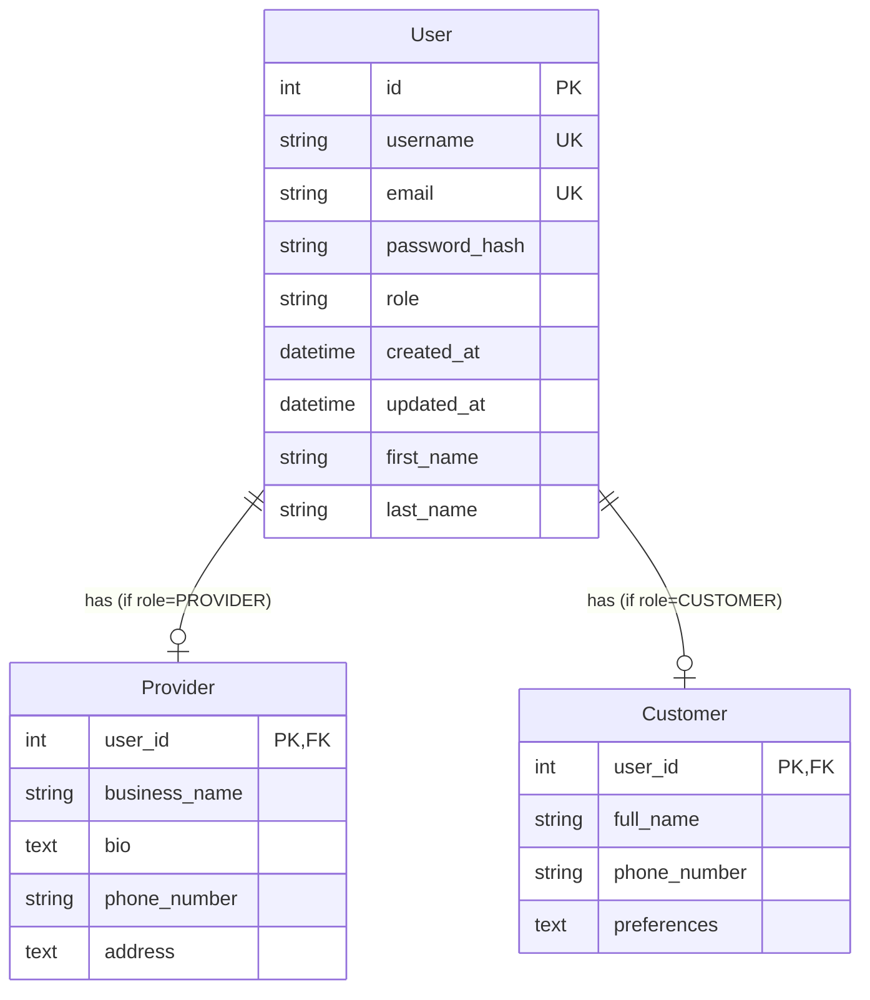

# Design Document: User Data Model and Repository Layer

## Overview

This design implements a user management system for AliceTant using Django's built-in authentication framework extended with custom user models. The system supports two user roles (Provider and Customer) with role-specific attributes, while maintaining a clean separation between data models and database access through a repository pattern.

The design prioritizes:
- **Strong consistency**: Leveraging Django's ORM transaction support and database constraints
- **Maintainability**: Clear separation between models, repositories, and business logic
- **Extensibility**: Easy addition of new user attributes or roles
- **Security**: Proper password hashing and validation using Django's authentication system

## Architecture

### Layered Architecture

```
┌─────────────────────────────────────┐
│     Services / Business Logic       │
│  (Future: authentication, booking)  │
└─────────────────┬───────────────────┘
                  │
                  ▼
┌─────────────────────────────────────┐
│      Repository Layer (New)         │
│  - UserRepository                   │
│  - Abstract database operations     │
└─────────────────┬───────────────────┘
                  │
                  ▼
┌─────────────────────────────────────┐
│      Django ORM / Models (New)      │
│  - User (extends AbstractUser)      │
│  - Provider profile                 │
│  - Customer profile                 │
└─────────────────┬───────────────────┘
                  │
                  ▼
┌─────────────────────────────────────┐
│         Database (SQLite)           │
└─────────────────────────────────────┘
```

### Design Decisions

1. **Custom User Model**: Extend Django's `AbstractUser` rather than using the default User model, allowing us to add role information directly to the user model and maintain flexibility for future changes.

2. **One-to-One Profile Pattern**: Use separate Provider and Customer models with one-to-one relationships to the User model, keeping role-specific data isolated and the User model clean.

3. **Repository Pattern**: Implement a repository layer to abstract database operations, making the codebase more testable and allowing potential database changes without affecting business logic.

4. **Role-Based Access**: Store role as a choice field on the User model rather than using Django's permission system, as we have simple, well-defined roles.

## Components and Interfaces

### 1. User Model (`backend/AliceTant/models/user.py`)

Extends Django's `AbstractUser` to include role information:

```python
class UserRole(models.TextChoices):
    PROVIDER = 'PROVIDER', 'Provider'
    CUSTOMER = 'CUSTOMER', 'Customer'

class User(AbstractUser):
    role = models.CharField(
        max_length=10,
        choices=UserRole.choices,
        null=False,
        blank=False
    )
    email = models.EmailField(unique=True)
    created_at = models.DateTimeField(auto_now_add=True)
    updated_at = models.DateTimeField(auto_now=True)
```

**Key Features:**
- Inherits username, password, first_name, last_name from AbstractUser
- Django automatically handles password hashing
- Unique constraint on email
- Automatic timestamp management

### 2. Provider Model (`backend/AliceTant/models/provider.py`)

```python
class Provider(models.Model):
    user = models.OneToOneField(
        User,
        on_delete=models.CASCADE,
        primary_key=True,
        related_name='provider_profile'
    )
    business_name = models.CharField(max_length=200)
    bio = models.TextField(max_length=2000, blank=True)
    phone_number = models.CharField(max_length=20, blank=True)
    address = models.TextField(blank=True)
```

### 3. Customer Model (`backend/AliceTant/models/customer.py`)

```python
class Customer(models.Model):
    user = models.OneToOneField(
        User,
        on_delete=models.CASCADE,
        primary_key=True,
        related_name='customer_profile'
    )
    full_name = models.CharField(max_length=200)
    phone_number = models.CharField(max_length=20, blank=True)
    preferences = models.TextField(blank=True)
```

### 4. Repository Interface (`backend/AliceTant/repositories/user_repository.py`)

The repository provides a clean interface for all user-related database operations:

```python
class UserRepository:
    """
    Repository for user data access operations.
    Abstracts database operations from business logic.
    """
    
    @staticmethod
    def create_user(username: str, email: str, password: str, 
                   role: str, **extra_fields) -> User:
        """Create a new user with hashed password."""
        
    @staticmethod
    def create_provider(user: User, business_name: str, 
                       bio: str = "", **extra_fields) -> Provider:
        """Create provider profile for a user."""
        
    @staticmethod
    def create_customer(user: User, full_name: str, 
                       **extra_fields) -> Customer:
        """Create customer profile for a user."""
        
    @staticmethod
    def get_user_by_id(user_id: int) -> User:
        """Retrieve user by ID."""
        
    @staticmethod
    def get_user_by_username(username: str) -> User:
        """Retrieve user by username."""
        
    @staticmethod
    def get_user_by_email(email: str) -> User:
        """Retrieve user by email."""
        
    @staticmethod
    def get_users_by_role(role: str) -> List[User]:
        """Retrieve all users with specified role."""
        
    @staticmethod
    def get_all_users(limit: int = 100, offset: int = 0) -> List[User]:
        """Retrieve all users with pagination."""
        
    @staticmethod
    def update_user(user: User, **fields) -> User:
        """Update user fields."""
        
    @staticmethod
    def delete_user(user_id: int) -> bool:
        """Delete user and associated profiles."""
        
    @staticmethod
    def user_exists(username: str = None, email: str = None) -> bool:
        """Check if user exists by username or email."""
```

### 5. Custom Exceptions (`backend/AliceTant/exceptions/user_exceptions.py`)

```python
class UserNotFoundError(Exception):
    """Raised when a user cannot be found in the database."""
    
class DuplicateUserError(Exception):
    """Raised when attempting to create a user with existing username/email."""
    
class InvalidUserDataError(Exception):
    """Raised when user data fails validation."""
```

## Data Models

### Entity Relationship Diagram



### Database Constraints

1. **Unique Constraints**:
   - `User.username` must be unique
   - `User.email` must be unique

2. **Foreign Key Constraints**:
   - `Provider.user` references `User.id` with CASCADE delete
   - `Customer.user` references `User.id` with CASCADE delete

3. **Check Constraints**:
   - `User.role` must be in {'PROVIDER', 'CUSTOMER'}
   - `Provider.bio` length ≤ 4096 characters

4. **Not Null Constraints**:
   - `User.username`, `User.email`, `User.role` cannot be null
   - `Provider.business_name` cannot be null
   - `Customer.full_name` cannot be null

## Correctness Properties

*A property is a characteristic or behavior that should hold true across all valid executions of a system—essentially, a formal statement about what the system should do. Properties serve as the bridge between human-readable specifications and machine-verifiable correctness guarantees.*


### Property 1: User creation round trip
*For any* valid user data (username, email, password, role), creating a user and then retrieving it by ID should return a user with all the same field values (except password should be hashed).
**Validates: Requirements 1.1, 1.4**

### Property 2: Role assignment validity
*For any* created user, the user's role must be exactly one value from the set {PROVIDER, CUSTOMER}.
**Validates: Requirements 1.2**

### Property 3: Uniqueness enforcement
*For any* existing user, attempting to create a new user with the same username or email should raise a DuplicateUserError.
**Validates: Requirements 1.3, 5.1, 5.2**

### Property 4: Password hashing
*For any* user created with a plaintext password, the stored password field should not equal the plaintext password.
**Validates: Requirements 1.4**

### Property 5: Timestamp management
*For any* user, the created_at timestamp should be set on creation, and the updated_at timestamp should change when the user is modified.
**Validates: Requirements 1.5**

### Property 6: Provider profile completeness
*For any* user with role PROVIDER, creating a provider profile should store and allow retrieval of business_name, bio, phone_number, and address fields.
**Validates: Requirements 2.1, 2.3**

### Property 7: Provider update preserves credentials
*For any* provider, updating provider-specific fields (business_name, bio, etc.) should not change the associated user's username, email, or password.
**Validates: Requirements 2.4**

### Property 8: Customer profile completeness
*For any* user with role CUSTOMER, creating a customer profile should store and allow retrieval of full_name, phone_number, and preferences fields.
**Validates: Requirements 3.1, 3.3**

### Property 9: CRUD operations consistency
*For any* user, performing create, read, update, and delete operations through the repository should maintain data consistency and return expected data types.
**Validates: Requirements 4.3, 4.5**

### Property 10: Query correctness
*For any* set of users, querying by username, email, or role should return only users matching the query criteria.
**Validates: Requirements 7.1, 7.2, 7.3**

### Property 11: Pagination correctness
*For any* set of users and pagination parameters (limit, offset), the paginated results should return the correct subset of users without duplicates or omissions.
**Validates: Requirements 7.4**

### Property 12: Exception type correctness
*For any* operation that fails due to validation errors versus database errors, the system should raise distinct exception types (InvalidUserDataError vs database-specific errors).
**Validates: Requirements 6.4**

## Error Handling

### Exception Hierarchy

```python
AliceTantException (base)
├── UserNotFoundError
├── DuplicateUserError
└── InvalidUserDataError
```

### Error Scenarios

1. **User Not Found**: Raised when querying for a non-existent user
   - Repository methods: `get_user_by_id`, `get_user_by_username`, `get_user_by_email`
   - HTTP Status: 404

2. **Duplicate User**: Raised when unique constraints are violated
   - Repository methods: `create_user`
   - HTTP Status: 409 (Conflict)

3. **Invalid User Data**: Raised when validation fails
   - Repository methods: `create_user`, `update_user`, `create_provider`, `create_customer`
   - HTTP Status: 400 (Bad Request)

### Error Handling Strategy

- Repository methods catch Django ORM exceptions and translate them to domain-specific exceptions
- All exceptions include descriptive messages without exposing database implementation details
- Validation occurs before database operations to fail fast
- Transaction rollback is automatic for failed operations

## Testing Strategy

### Unit Testing

We will use Django's built-in test framework (`django.test.TestCase`) for unit tests. Unit tests will cover:

1. **Model Validation**:
   - Test that User model enforces required fields
   - Test that email uniqueness is enforced
   - Test that role choices are validated
   - Test bio length constraint (edge case: exactly 2000 chars, 2001 chars)

2. **Repository Method Examples**:
   - Test creating a provider user with valid data
   - Test creating a customer user with valid data
   - Test querying non-existent user raises UserNotFoundError
   - Test duplicate username raises DuplicateUserError
   - Test duplicate email raises DuplicateUserError

3. **Profile Relationships**:
   - Test that deleting a user cascades to provider/customer profile
   - Test that a user can have only one profile type

### Property-Based Testing

We will use **Hypothesis** for property-based testing in Python. Hypothesis will be configured to run a minimum of 100 iterations per property test.

Each property-based test will:
- Be tagged with a comment explicitly referencing the correctness property from this design document
- Use the format: `# Feature: user-data-model, Property {number}: {property_text}`
- Generate random but valid test data using Hypothesis strategies
- Verify the property holds across all generated inputs

Property tests will cover:

1. **Property 1: User creation round trip** - Generate random user data, create user, retrieve and verify fields match
2. **Property 2: Role assignment validity** - Generate random users, verify role is always valid
3. **Property 3: Uniqueness enforcement** - Generate users, attempt duplicates, verify rejection
4. **Property 4: Password hashing** - Generate random passwords, verify they're hashed
5. **Property 5: Timestamp management** - Create and update users, verify timestamps
6. **Property 6: Provider profile completeness** - Generate random provider data, verify all fields persist
7. **Property 7: Provider update preserves credentials** - Update provider profiles, verify user credentials unchanged
8. **Property 8: Customer profile completeness** - Generate random customer data, verify all fields persist
9. **Property 9: CRUD operations consistency** - Perform random CRUD operations, verify consistency
10. **Property 10: Query correctness** - Generate random user sets, query and verify results
11. **Property 11: Pagination correctness** - Generate random user sets, paginate and verify correctness
12. **Property 12: Exception type correctness** - Trigger various errors, verify exception types

### Test Data Generation

Hypothesis strategies will be created for:
- Valid usernames (alphanumeric, 3-150 chars)
- Valid emails (proper email format)
- Passwords (8-128 chars)
- Roles (PROVIDER or CUSTOMER)
- Business names, bios, phone numbers, addresses
- Customer names and preferences

### Integration Testing

Integration tests will verify:
- Django migrations create correct database schema
- Database constraints are properly enforced at the database level
- Transactions work correctly for multi-step operations

## Implementation Notes

### Django Configuration

1. **Custom User Model**: Must be set in `settings.py` before first migration:
   ```python
   AUTH_USER_MODEL = 'AliceTant.User'
   ```

2. **Password Hashing**: Django automatically uses PBKDF2 with SHA256 by default. No additional configuration needed.

3. **Database Indexes**: Add indexes for frequently queried fields:
   - `User.username` (automatic via unique=True)
   - `User.email` (automatic via unique=True)
   - `User.role` (add manually for filtering)

### Migration Strategy

1. Create initial User model migration
2. Create Provider and Customer model migrations
3. Run migrations on clean database (no existing auth.User data)

### Repository Implementation Details

- Use Django's `select_related()` for queries that need profile data to avoid N+1 queries
- Use `get_or_create()` for idempotent operations where appropriate
- Wrap database operations in try-except blocks to catch and translate Django ORM exceptions
- Use type hints for all method signatures

### Security Considerations

1. **Password Storage**: Never store plaintext passwords; always use Django's `make_password()` or User model's `set_password()` method
2. **Password Validation**: Use Django's password validators configured in settings
3. **SQL Injection**: Django ORM provides protection; avoid raw SQL queries
4. **Mass Assignment**: Explicitly specify allowed fields in repository methods

## Future Enhancements

1. **Email Verification**: Add email_verified boolean field and verification token
2. **Business Entity**: Add a new data model for business, each business can have an address including country, state, city and postal code plus phone number and and an info (a string, roughly three paragraphs). Each business should have a unique identification integer to distinguish between businesses with the same name.